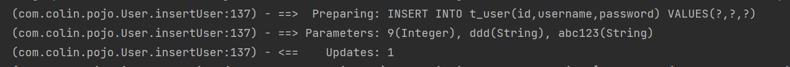

# 原始方式增删改查
## 一、导包
1. mysql-connector-java
2. mybatis
3. log4j：用于mybatis输出日志
> log4j需要进行配置：<br>
> 文档参考：https://blog.csdn.net/Lzy410992/article/details/115631414
## 二、获取SqlSessionFactory，
1. 创建配置文件
    **jdbc.properties：**
    ```properties
    jdbc.driver=com.mysql.jdbc.Driver
    jdbc.url=jdbc:mysql://localhost:3306/db_test?useSSL=false
    jdbc.username=root
    jdbc.password=wanglong
    ```
    **mybatis.xml：**   
    ```xml
    <?xml version="1.0" encoding="UTF-8" ?>
    <!DOCTYPE configuration
            PUBLIC "-//mybatis.org//DTD Config 3.0//EN"
            "http://mybatis.org/dtd/mybatis-3-config.dtd">
    <configuration>
        <properties resource="jdbc.properties"/>
        <environments default="development">
            <environment id="development">
                <transactionManager type="JDBC"/>
                <dataSource type="POOLED">
                    <property name="driver" value="${jdbc.driver}"/>
                    <property name="url" value="${jdbc.url}"/>
                    <property name="username" value="${jdbc.username}"/>
                    <property name="password" value="${jdbc.password}"/>
                </dataSource>
            </environment>
        </environments>
    
        <mappers>
            <mapper resource="com/colin/dao/UserMapper.xml"/>
        </mappers>
    </configuration>
    ```
2. 使用SqlSessionFactoryBuilder.build创建
    **DBUtil：**
    ```java
    import org.apache.ibatis.io.Resources;
    import org.apache.ibatis.session.SqlSession;
    import org.apache.ibatis.session.SqlSessionFactory;
    import org.apache.ibatis.session.SqlSessionFactoryBuilder;
    
    import java.io.Closeable;
    import java.io.IOException;
    import java.io.InputStream;
    
    public class DBUtil {
        public static SqlSession getSqlSession() throws IOException {
            //1. 读取主配置文件
            InputStream inputStream = Resources.getResourceAsStream("mybatis.xml");
            //2. 获取SqlSessionFactory
            SqlSessionFactory sqlSessionFactory = new SqlSessionFactoryBuilder().build(inputStream);
            //3. openSession获取SqlSession
            //openSession不给参数默认是false，表示需要手动提交
            return sqlSessionFactory.openSession();
        }
    
        public static void closeResource(Closeable... closeables){
            for (Closeable closeable : closeables) {
                if (null != closeable) {
                    try {
                        closeable.close();
                    } catch (IOException e) {
                        e.printStackTrace();
                    }
                }
            }
        }
    }
    ```
# 三、获取SqlSession，调用insert,delete,update,selectOne等方法。
**UserDao：**
```java
public class UserDao {
    public void insertUser(User user) {
        //1. 获取SqlSession实例
        SqlSession sqlSession = null;
        try {
            sqlSession = DBUtil.getSqlSession();
            //2. 使用sqlsession调用insert方法
            sqlSession.insert("insertUser", user);
            //3. 手动提交
            sqlSession.commit();
        } catch (IOException e) {
            e.printStackTrace();
        } finally {
            //4. 关闭资源
            DBUtil.closeResource(sqlSession);
        }
    }
}
```
# 四、 编写Mapper.xml文件将方法和查询语句关联
**UserMapper.xml**
```xml
<?xml version="1.0" encoding="UTF-8" ?>
<!DOCTYPE mapper
        PUBLIC "-//mybatis.org//DTD Mapper 3.0//EN"
        "http://mybatis.org/dtd/mybatis-3-mapper.dtd">
<mapper namespace="com.colin.pojo.User">
    <insert id="insertUser">
        INSERT INTO t_user(id,username,password) VALUES(#{id},#{username},#{password})
    </insert>
</mapper>
```
六、调用测试
```java
public class UserDaoTest extends TestCase {
    UserDao userDao = new UserDao();

    public void testInsertUser() {
        userDao.insertUser(new User(9,"ddd","abc123"));
    }
}
```


**注意：**
1. 默认情况下，使用`#{}`参数语法时，MyBatis 会创建`PreparedStatement`参数占位符，并通过占位符安全地设置参数（就像使用 ? 一样）。
2. `#{}`当其只有一个参数的时候，参数名可以任意命名，但是中间不能有空格
3. `#{}`参数有多个时，会先通过getter方法名进行匹配，如果无法匹配，再根据类中字段名匹配。
4. 在mybatis主配置文件中需要使用`<mapper>`制定mapper文件的位置，当mapper文件放在java目录下而不是resources目录下时，
Maven在编译时默认是不会加载java目录下的文件到classes目录下的，需要进行相关配置。参考文档呢：https://blog.csdn.net/jdbdh/article/details/89068289
5. 例如在执行insert语句的时候需要传入多个参数，除了使用User这种特定类进行封装，还可以使用Map集合进行封装。
6. 增删改涉及到事务操作的才需要提交，查询不涉及事务，所以不需要提交。
7. 在Mapper.xml文件中，`<select>`必须要制定返回的类型，属性为`resultType`
8. Mapper.xml文件中的`parameterType`属性可以省略，mybatis会自动识别。

